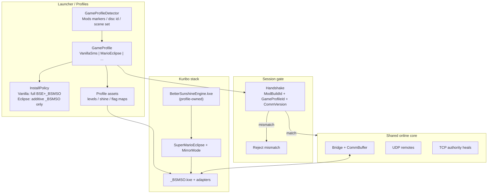

# BSMSO 2.0 — Mario Eclipse & Multi-BSE-Mod Support

Research date: 2026-07-29  
Status: architecture decision (no code yet)  
Primary target: **Super Mario Eclipse** → pattern for other BSE mods  
Sources: in-repo Install/sync, [JoshuaMKW/Super-Mario-Eclipse](https://github.com/JoshuaMKW/Super-Mario-Eclipse), GameBanana, browser, local `SME files` + `GMSE04` ISO inventory (bsmso-dev-agent research pass)

## 1. Executive recommendation

**Winning approach: Hybrid A + C + E — side-by-side Game Profiles + thin Mod Adapter + hard `GameProfileId` session gate.**

Keep one BSMSO online core (mailbox, remotes, host/join, authority heals). Isolate every mod-specific truth (stage catalog, warp rules, shine/blue/story maps, install policy, Dolphin GameINI id) behind a **Game Profile** (`VanillaSms` / `MarioEclipse` / future).

For Eclipse specifically:

1. **Never** overwrite Eclipse’s `sys/main.dol`, `sys/boot.bin`, `BetterSunshineEngine.kxe`, Moveset, MirrorMode, SME module, or `nintendo.szs`/`option.szs` with DotKuribo/BSMSO vanilla payloads.
2. Install mode = **additive inject-only**: drop `_BSMSO.kxe` (+ build marker) into existing `files/Kuribo!/Mods/` after BSE → Moveset → MirrorMode → SuperMarioEclipse.
3. Load a **profile adapter** (JSON + module tables) for stages/warps/shines — shared sync core stays the same.
4. Gate lobbies on **`GameProfileId` + `ModBuildId`** (hard cut). Flag Sync **off by default** on Eclipse until maps are measured.

Do **not** fork the whole protocol per mod, do **not** soft-negotiate collectible layouts in MVP, do **not** pivot to SMSCoop split-screen ([Eclipse Co-op](https://gamebanana.com/mods/651485) is a different product). Optional later: Eclipse-team compat shim.

## 2. What Eclipse is (verified)

### Product / shipping
- Full SMS overhaul: ~120 altered + ~120 new shines (`MaxShineCount = 240`), new stages, multi-character, custom objects/bosses, THPs.
- Ships as **xdelta → ISO** ([GameBanana 536309](https://gamebanana.com/mods/536309)).
- Source builds Kuribo module `SuperMarioEclipse.kxe` ([JoshuaMKW/Super-Mario-Eclipse](https://github.com/JoshuaMKW/Super-Mario-Eclipse)).
- Registers via BSE: `BetterSMS::ModuleInfo("Super Mario Eclipse", …)`, `Game::setMaxShines(240)`, stages **61–92** (`include/stage.hxx`).

### Local artifacts (this machine)
| Path | Finding |
|------|---------|
| `Desktop\Gamecube Games\(GMSE04) Super Mario Eclipse v1.0.4.iso` | Disc id **`GMSE04`**, ~1.46 GiB |
| `Desktop\SME files\` | Extracted `sys/` + `files/` |
| `SME files\files\Kuribo!\Mods\` | BSE **571104**, Moveset **43520**, MirrorMode **13376**, SuperMarioEclipse **350016** |
| `SME files\sys\boot.bin` | Already **`GMSE90`** (remixed); ISO header still `GMSE04` — **do not trust boot id alone** |
| `SME files\files\data\scene\` | **211** scene archives vs vanilla **108** |

### Critical size mismatch vs BSMSO 1.1 pins
| Binary | Eclipse local | BSMSO Install pin |
|--------|---------------|-------------------|
| `BetterSunshineEngine.kxe` | **571104** | **583744** (DotKuribo v4.0.0) |
| `BetterSunshineMoveset.kxe` | **43520** | **46976** |

Forcing BSMSO’s official BSE/Moveset into Eclipse is a **black-screen class** failure (same family as `docs/research/11-disc-speed-bse-moveset.md`).

### Typical Kuribo load order
`BetterSunshineEngine.kxe` → `BetterSunshineMoveset.kxe` → `MirrorMode.kxe` → `SuperMarioEclipse.kxe` → **`_BSMSO.kxe`** (underscore = last).

### Shine capacity good news
BSMSO already uses a **256-bit** shine ownership bitset (`ProtocolConstants.ShineBitCapacity = 256`). Eclipse’s **240** shines fit without a wire-format expansion for ownership MVP. Module story paths that still assume 120 must be profile-aware.

## 3. Conflict surface with current Install

Today’s Install ([`ModuleInstaller.cs`](../../launcher/SMSO.Launcher/ModuleInstaller.cs)) always downloads official BSE v4, overwrites `main.dol`/`boot.bin`, writes Moveset + `_BSMSO.kxe`, and may overlay UI archives. On Eclipse that **destroys** the mod stack.

| Surface | Vanilla BSMSO | Eclipse collision |
|---------|---------------|-------------------|
| Install overwrite | Full BSE runtime replace | Lethal |
| Disc Game ID | Force `GMSE90` | Official `GMSE04`; local extract may already be remixed to 90 |
| Module set | Engine + optional Moveset + `_BSMSO` | + MirrorMode + SME |
| Stage catalog | `levels.ntsc-u.json` ≤60 | Areas **61–92** + remapped hub (`STAGE_ISLE_DELFINO=78`) |
| `stage_guard` | area>60 treated as test/debug | Eclipse **gameplay** areas are >60 |
| Flag Sync maps | Vanilla shine/story/blue | Wrong maps = softlocks / corruption |
| Disc overlays | BSMSO nintendo/option sizes | Eclipse sizes differ — overlay breaks UI |
| Character packs | BSMSO remount | Fights Eclipse char archives / select |
| Handshake | ModBuildId only | Vanilla↔Eclipse would join then desync |

Existing research `01`–`14` still valid for core sync; **none** covered multi-mod profiles before this doc.

## 4. Strategy comparison

| Approach | Reliability | Effort | Verdict |
|----------|-------------|--------|---------|
| **A Side-by-side profiles** | High (install safety) | Med | **Required** |
| **B Eclipse-forked protocol** | High isolation | Very high | Reject as primary |
| **C Thin Mod Adapter** | High if tables complete | Med–High | **Required** |
| **D Eclipse ABI shim** | Highest long-term | Needs external | Phase 3+ optional |
| **E Hard GameProfileId + ModBuildId** | Highest session safety | Low | **Required MVP** |
| Soft feature negotiation | Risky for flags/stages | Med | Defer |
| Replace Eclipse BSE w/ DotKuribo v4 | **Very low** | Low short | **Do not** |
| SMSCoop / split-screen | N/A | Product rewrite | **Do not** |
| **F Hybrid A+C+E** | Best overall | Med staged | **WINNER** |

## 5. Architecture

## 6. Phased milestones

### Phase 0 — Safety rails ✅ (done)
- Detector: Vanilla vs Eclipse vs Unknown
- Eclipse Install refuses BSE/Moveset/DOL/boot/overlay overwrite
- Eclipse Install only drops `_BSMSO.kxe` + marker
- Handshake carries `GameProfileId`; Vanilla↔Eclipse reject

### Phase 1 — MVP presence (first playable) ✅ (launcher/server done)
- Host/join on Eclipse: `GameServer.ExpectedGameProfileId` (launcher auto-detects from Game ISO; `ServerHost.exe --profile=eclipse` / `BSMSO_GAME_PROFILE`)
- Flag Sync **hard OFF** on Eclipse (server coerces `SetSyncSettings`; launcher keeps bridge/UI in sync)
- Warp pass-through on Eclipse (no vanilla catalog validation / Sirena remaps); episode ids raw (no plaza/hotel/park/casino remaps)
- Launch gates Eclipse-aware: `ValidateInstalledModule`/`ValidateBootReadyModules` skip official-size pins; game id/banner/cover writes skipped (GMSE04 kept)
- Module unchanged: `stage_guard` already passes areas >60 through plain `moveStage` (doesn't fight SME warps)
- Remaining for first playable confirmation: boot Eclipse with `_BSMSO.kxe` injected; Dolphin log shows all five modules loaded

### Phase 2 — Catalog + warp UX
- `levels.eclipse.json` for 61–92 + remaps
- Vetted warp subset (hub + 1–2 Eclipse stages)

### Phase 3 — Collectibles
- 240-shine ownership round-trip (protocol already sized)
- Blue maps for new courses; story still gated

### Phase 4 — Story parity + generic BSE-mod kit
- Unlock/story bits; character remote policy
- Document “BSMSO-ready” checklist for Chaos-like mods
- Optional Eclipse-team compat note

## 7. Detection recipe

1. `SuperMarioEclipse.kxe` under `files/Kuribo!/Mods/`
2. Disc id `GMSE04` / title “Super Mario Eclipse”
3. Content markers: `char_select.szs`, `ertoRock*`, scene count ≫ 108
4. Else vanilla BSE+_BSMSO / normal scene set → VanillaSms
5. Else Unknown → block Host/Install with clear message

**Do not trust `GMSE90` alone** (local SME extract already remixed).

## 8. Install / Update UX (preserve 1.1)

| User points at | Install | Update |
|----------------|---------|--------|
| Vanilla / GMSE90 BSMSO tree | Current 1.1 full Install | Marker + kxe refresh |
| Eclipse extract / GMSE04 ISO | **Additive `_BSMSO.kxe` only** | Replace `_BSMSO.kxe` only |
| Unknown / mixed | Refuse | Refuse |

Keep separate game roots (already true locally: vanilla sms tree vs `SME files` vs Eclipse ISO).

## 9. Concrete touch list

| Area | Work |
|------|------|
| `SMSO.Net` | `GameProfileId` on join; reject mismatch |
| `ModuleInstaller` / disc patchers | Profile install policies |
| Launcher Settings | Active profile + dual paths |
| `DolphinConfigService` | GameINI for `GMSE04` (or dedicated online id) |
| Assets | `assets/adapters/eclipse/*` catalogs |
| Module | `stage_guard`, `world_sync`, story shine counts — profile tables |
| Models | Don’t remount over Eclipse chars until policy exists |
| Packaging | Real 2.0 profile support (not label-only `package-split`) |
| Tests | Install refusal; ProfileMismatch; catalog load |

## 10. Do NOT

1. Run current Install on an Eclipse tree  
2. Replace Eclipse BSE with DotKuribo 583744 “to unify”  
3. Overlay BSMSO `nintendo.szs` / `option.szs` onto Eclipse  
4. Allow Vanilla ↔ Eclipse lobbies  
5. Soft-negotiate shine/stage layouts in MVP  
6. Enable Flag Sync on Eclipse before maps are measured  
7. Assume area ≤ 60 logic applies to stages 61–92  
8. Treat `package-split` 2.0 labels as Eclipse support  
9. Pivot to SMSCoop / Dolphin Netplay lockstep  
10. Ship DEBUG BSE into any profile  

## 11. Open questions

1. Prefer canonical Eclipse **v1.1.0** dump vs local **v1.0.4** ISO for adapter extraction  
2. Full shine id 0–239 → FlagManager map  
3. Blue/story/unlock bit lists for new content  
4. Keep disc id `GMSE04` online vs introduce e.g. `GMSE91` for Dolphin settings isolation  
5. Character-select multiplayer policy  
6. Whether MirrorMode must be enabled for all peers  
7. Confirm BSE 571104 commit/ABI vs `_BSMSO.kxe` built against this repo’s BSE submodule  

## 12. Immediate next action

**Phase 0 engineering:** profile detector + Eclipse additive Install prototype (vanilla path unchanged), then boot Eclipse with `_BSMSO.kxe` injected and confirm mailbox + remotes with Flag Sync off.

Lab paths already available:
- `C:\Users\young\OneDrive\Desktop\SME files`
- `C:\Users\young\OneDrive\Desktop\Gamecube Games\(GMSE04) Super Mario Eclipse v1.0.4.iso`
